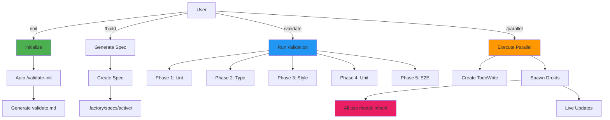
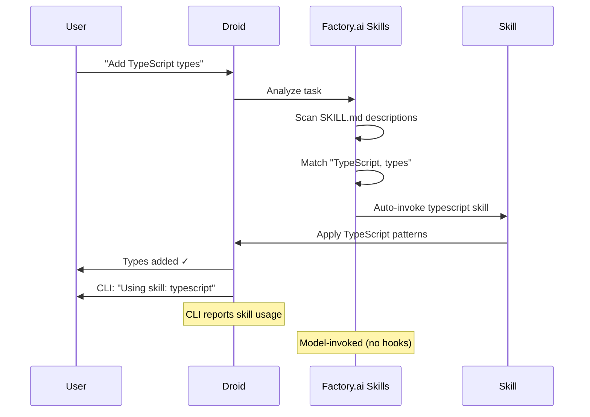

# Droidz Framework v3.0: Factory.ai-Native Architecture Refactor

## Summary
Complete refactor of Droidz to fully leverage Factory.ai's native capabilities: Skills system (v0.26.0), proper custom droid configuration with `model: inherit`, comprehensive validation workflows, and elimination of all non-standard patterns. Includes complete README refactor aligned with v3.0 changes.

---

## 🎯 Core Problems Identified

### 1. **Skills System - Confirmed Native Support**
- ✅ **Factory.ai officially supports Skills** (v0.26.0, November 14, 2024)
- ✅ **CLI reports skill usage** - Skills are model-invoked automatically
- ✅ Use `/skills` command to manage skills
- Current Droidz skills don't follow proper SKILL.md format with clear "Use when..." descriptions

### 2. **Custom Droids - Model Inheritance Issue**
- ❌ **CRITICAL**: All droids MUST use `model: inherit` (per Factory.ai docs)
- ✅ "Custom droids are reusable subagents... model preference" - supports model selection
- ✅ "`model: inherit` (use parent session's model)" - **this is the default and recommended**
- Current droids already have `model: inherit` ✅ but needs verification across all 15 droids

### 3. **Architecture Issues**
- `.droidz/` folder outside `.factory/` (non-standard)
- Installer references unused features (git worktrees, tmux)
- Commands use inconsistent naming

### 4. **Missing Features**
- No comprehensive validation workflow
- No progress reporting during parallel execution
- Specs not properly gitignored

### 5. **README Issues**
- References outdated folder structure (`.droidz/`)
- Missing v3.0 features explanation
- No Factory.ai Skills system documentation
- No model inheritance explanation
- Missing validation workflow info

---

## 🏗️ New Architecture

### Folder Structure (100% `.factory/`-based)

```
.factory/
├── commands/              # Slash commands
│   ├── init.md           # /init
│   ├── build.md          # /build
│   ├── validate.md       # /validate (auto-generated)
│   ├── validate-init.md  # /validate-init (generator)
│   └── parallel.md       # /parallel
├── droids/               # 15 custom droids (ALL use model: inherit)
│   ├── droidz-orchestrator.md    # model: inherit ✓
│   ├── droidz-codegen.md         # model: inherit ✓
│   ├── droidz-test.md            # model: inherit ✓
│   └── [12 other droids - all model: inherit]
├── skills/               # Factory.ai Skills (SKILL.md format)
│   ├── typescript/
│   │   └── SKILL.md      # Proper "Use when..." description
│   ├── react/
│   │   └── SKILL.md
│   └── [60 other skills]
├── hooks/                # Lifecycle hooks
│   ├── scripts/
│   │   ├── auto-lint.sh
│   │   ├── validate-on-edit.sh (NEW)
│   │   └── block-dangerous.sh (NEW)
│   └── settings.json     # Hook configuration
├── specs/                # Generated specs
│   ├── active/          # Current work (gitignored)
│   ├── archived/        # Completed specs
│   └── templates/       # Spec templates
├── validation/          # Validation framework (NEW)
│   ├── .validation-cache/
│   └── test-helpers/
└── memory/              # Persistent context
    ├── org/
    └── user/
```

---

## 🔧 Implementation Plan

### Phase 1: Skills System - Factory.ai Native Format

**Factory.ai Skills Documentation:**
- **Model-invoked**: Droids auto-invoke based on description
- **Format**: `SKILL.md` with YAML frontmatter
- **Location**: `.factory/skills/{skill-name}/SKILL.md`
- **CLI Integration**: Use `/skills` command to manage

**Required Changes:**

1. **Update All 61 Skills to Proper Format**

```markdown
---
name: typescript
description: Use when user mentions TypeScript, types, interfaces, generics, or type safety. Expert in TypeScript best practices including advanced types, utility types, and strict mode configuration.
allowed-tools: ["Read", "Edit", "Create", "Grep", "Glob"]
---

# TypeScript Best Practices

## When to Use This Skill
- User mentions TypeScript, types, interfaces
- Type errors need fixing
- Type definitions needed
- Generics or utility types needed

## Instructions
[TypeScript guidelines]
```

**Key Requirements:**
- `description` field MUST state "Use when..." - this is how Factory.ai auto-invokes
- Clear trigger keywords
- Specify `allowed-tools` for each skill

---

### Phase 2: Custom Droids - Verify Model Inheritance

**Factory.ai Documentation States:**
> "`model: inherit` (use parent session's model), or specify a model identifier."

**CRITICAL**: All droids MUST use `model: inherit` to respect user's model selection.

**Verification Required:**

```markdown
---
name: droidz-codegen
description: Implements features and bugfixes with comprehensive tests
model: inherit  # ✅ REQUIRED - inherits from parent session
tools: ["Read", "LS", "Execute", "Edit", "Create", "Grep", "Glob", "TodoWrite", "WebSearch", "FetchUrl"]
---
```

**Check All 15 Droids:**
- [ ] droidz-orchestrator.md → `model: inherit`
- [ ] droidz-codegen.md → `model: inherit`
- [ ] droidz-test.md → `model: inherit`
- [ ] droidz-refactor.md → `model: inherit`
- [ ] droidz-infra.md → `model: inherit`
- [ ] droidz-integration.md → `model: inherit`
- [ ] droidz-ui-designer.md → `model: inherit`
- [ ] droidz-ux-designer.md → `model: inherit`
- [ ] droidz-database-architect.md → `model: inherit`
- [ ] droidz-api-designer.md → `model: inherit`
- [ ] droidz-security-auditor.md → `model: inherit`
- [ ] droidz-performance-optimizer.md → `model: inherit`
- [ ] droidz-accessibility-specialist.md → `model: inherit`
- [ ] droidz-generalist.md → `model: inherit`

**Tools Configuration:**
- All droids should have explicit `tools: [...]` arrays
- Use Factory.ai tool names (case-sensitive):
  - `Read`, `LS`, `Grep`, `Glob` (read-only)
  - `Create`, `Edit`, `ApplyPatch` (modifications)
  - `Execute` (shell commands)
  - `WebSearch`, `FetchUrl` (web)
  - `TodoWrite` (progress tracking)

---

### Phase 3: Validation Workflow (Original Droidz Feature)

**New Commands:**

**1. `/validate-init`** (Generator)
```markdown
---
description: Generate project-specific validation workflow
---

Analyze codebase and create `.factory/commands/validate.md`:

1. **Detect Tools**
   - Linters: ESLint, ruff, pylint
   - Type checkers: TypeScript, mypy
   - Formatters: Prettier, black
   - Test frameworks: Jest, pytest, Playwright

2. **Generate 5-Phase Validation**
   - Phase 1: Linting
   - Phase 2: Type Checking
   - Phase 3: Style Checking
   - Phase 4: Unit Tests
   - Phase 5: E2E Tests

3. **Create Test Helpers**
   - Scripts in `.factory/validation/test-helpers/`
   - Docker setup if needed

**Auto-runs on first /init**
```

**2. `/validate`** (Executor - auto-generated per project)
```markdown
---
description: Run comprehensive validation
---

## Phase 1: Linting
!`npm run lint`

## Phase 2: Type Checking
!`tsc --noEmit`

## Phase 3: Style Checking
!`prettier --check .`

## Phase 4: Unit Tests
!`npm test -- --coverage`

## Phase 5: E2E Tests
### Setup
!`docker-compose up -d`

### Test Workflows
!`npx playwright test`

### Cleanup
!`docker-compose down -v`
```

---

### Phase 4: Enhanced Hooks System

**Factory.ai Supports 7 Hook Types** (as of v0.25.0):
1. SessionStart
2. SessionEnd  
3. PreToolUse
4. PostToolUse
5. UserPromptSubmit
6. Stop
7. SubagentStop

**New Hooks Configuration:**

```json
{
  "hooks": {
    "SessionStart": [
      {
        "name": "auto-validate-init",
        "type": "prompt",
        "prompt": "On first session: Check if .factory/commands/validate.md exists. If not, suggest /validate-init."
      }
    ],
    "PostToolUse": [
      {
        "matcher": "Edit|Create",
        "hooks": [
          {
            "name": "auto-lint",
            "type": "command",
            "command": ".factory/hooks/scripts/auto-lint.sh",
            "description": "Auto-lint after edits"
          }
        ]
      }
    ],
    "PreToolUse": [
      {
        "matcher": "Execute",
        "hooks": [
          {
            "name": "block-dangerous",
            "type": "command",
            "command": ".factory/hooks/scripts/block-dangerous.sh",
            "description": "Block rm -rf, dd, etc."
          }
        ]
      }
    ],
    "Stop": [
      {
        "name": "session-summary",
        "type": "prompt",
        "prompt": "Before ending: Summarize work, note incomplete tasks, save decisions."
      }
    ],
    "SubagentStop": [
      {
        "name": "update-todos",
        "type": "prompt",
        "prompt": "After subagent completes: Update TodoWrite progress."
      }
    ]
  }
}
```

---

### Phase 5: Progress Reporting (Factory.ai Native)

**Solution:** TodoWrite-based progress (built-in Factory.ai tool)

**Implementation:**

When `/parallel` executes:
1. Create TodoWrite with all tasks
2. Subagents update todos on completion
3. User sees live progress
4. No external dependencies

**Example:**
```
User: /parallel "build auth system"

TodoWrite:
✅ Database schema (3 files)
⏳ API endpoints (auth.ts, login.ts)
⏸️ Frontend UI (pending)
⏸️ Tests (pending)

[Progress updates automatically]

✅ Database schema
✅ API endpoints (5 files, tests passing)
⏳ Frontend UI (LoginForm.tsx)
⏸️ Tests (pending)
```

---

### Phase 6: Installer Refactor

**New Installer (Minimal, Factory.ai-native):**

```bash
#!/bin/bash
# Droidz Installer v3.0

set -euo pipefail

VERSION="3.0.0"
GITHUB_RAW="https://raw.githubusercontent.com/korallis/Droidz/main"

echo "🤖 Droidz v${VERSION} - Factory.ai Framework"

# 1. Verify Factory.ai CLI
if ! command -v droid &> /dev/null; then
  echo "❌ Factory.ai Droid CLI required"
  echo "Install: https://factory.ai"
  exit 1
fi

echo "✓ Factory.ai Droid CLI detected"

# 2. Download .factory/ folder
echo "📥 Downloading framework..."
curl -sL "$GITHUB_RAW/install-files.tar.gz" | tar xz

# 3. Initialize
echo "🔧 Initializing..."
droid --initial-prompt "/init"

echo "✅ Installation complete!"
echo ""
echo "🚀 Commands:"
echo "   /init     - Initialize project"
echo "   /build    - Generate spec"
echo "   /parallel - Execute in parallel"
echo "   /validate - Run validation"
```

**Removed:**
- Git worktree setup (unused)
- tmux installation (unused)
- Complex OS detection
- Repository requirements

---

### Phase 7: .gitignore Updates

```gitignore
# Droidz Framework for Factory.ai

# Active work (never commit)
.factory/specs/active/
.factory/validation/.validation-cache/

# User-specific (never commit)
.factory/memory/user/

# Generated validation (commit template, not instances)
.factory/commands/validate.md

# Secrets (never commit)
config.yml
!config.example.yml

# No .droidz/ folder - everything in .factory/
```

---

### Phase 8: README.md Refactor (NEW)

**Requirements:**
- Preserve Discord and PayPal section (top)
- Align with v3.0 architecture
- Document all new features
- Explain what's improved
- Simple but detailed
- Focus on user benefits

**New README Structure:**

```markdown
# 🤖 Droidz

> **Production-grade AI development framework for Factory.ai Droid CLI**

Transform vague ideas into production code with AI-powered validation, native skills, and intelligent parallel execution.

[](https://opensource.org/licenses/MIT)
[](https://github.com/korallis/Droidz)
[](https://polar.sh/checkout/polar_c_Pse3hFdgwFUqomhsOL8wIN5ETXT6UsxNWTvx11BdyFW)
[](https://www.paypal.com/paypalme/gideonapp)

---

## 💬 Join Our Discord Community

**Built specifically for Ray Fernando's Discord members!** 🎯

Get early access, share tips, connect with contributors, and influence future development.

**[→ Join Discord Community](https://polar.sh/checkout/polar_c_Pse3hFdgwFUqomhsOL8wIN5ETXT6UsxNWTvx11BdyFW)**

---

## 💝 Support This Project

If Droidz saves you time, consider supporting its development!

**[→ Donate via PayPal](https://www.paypal.com/paypalme/gideonapp)** (@gideonapp)

Your support helps maintain and improve this framework! 🙏

---

## ✨ What's New in v3.0

Droidz v3.0 is a complete architectural refactor that fully leverages Factory.ai's native capabilities:

### 🎯 Major Improvements

**1. Native Factory.ai Skills System** ✨
- **Skills auto-activate** based on your code context
- No manual skill selection needed
- Uses Factory.ai's official Skills system (v0.26.0)
- Skills are **model-invoked** - CLI reports when used
- Manage with `/skills` command

**2. Perfect Model Inheritance** 🎨
- All 15 specialist droids use `model: inherit`
- **Your model choice is always respected**
- Switch models → all droids switch automatically
- No more conflicting models

**3. Comprehensive Validation** ✅
- **`/validate-init`** - Auto-generates project-specific validation
- **`/validate`** - Runs 5-phase validation pipeline
  - Phase 1: Linting (ESLint, ruff, etc.)
  - Phase 2: Type checking (TypeScript, mypy)
  - Phase 3: Style checking (Prettier, black)
  - Phase 4: Unit tests
  - Phase 5: E2E tests (workflow-based)
- **One command to validate everything**

**4. Live Progress Tracking** 📊
- Real-time TodoWrite updates during parallel execution
- See exactly what each droid is doing
- No more guessing if work is stuck
- Built on Factory.ai's native TodoWrite tool

**5. Clean Architecture** 🏗️
- **100% `.factory/`-based** - no external folders
- Eliminated `.droidz/` folder confusion
- Standard Factory.ai conventions
- Proper gitignore patterns

**6. Enhanced Hooks System** 🪝
- All 7 Factory.ai hook types supported
- Auto-lint after file edits
- Block dangerous commands (rm -rf, dd, etc.)
- Session summaries on exit
- Subagent completion tracking

**7. Simplified Installation** ⚡
- < 30 second installation
- No git worktree setup needed
- No tmux installation required
- Just Factory.ai CLI + Droidz

---

## 🚀 Quick Start

### Installation

```bash
curl -fsSL https://raw.githubusercontent.com/korallis/Droidz/v3.1.4/install.sh | bash
```

Or download first:

```bash
wget https://raw.githubusercontent.com/korallis/Droidz/v3.1.4/install.sh
chmod +x install.sh
./install.sh
```

### Enable in Factory.ai

```bash
droid
/settings
# Toggle "Custom Droids" ON
# Toggle "Hooks" ON
```

Restart: `Ctrl+C` and run `droid` again.

### Verify

```bash
/droids           # See all 15 specialist droids
/skills           # Manage skills
```

---

## 💡 The Simple Workflow

```bash
# Step 1: Initialize your project
/init

# Step 2: Generate validation workflow (auto-runs on /init)
/validate-init

# Step 3: Build something
/build "add user authentication with JWT"
# → Asks clarifying questions
# → Generates .factory/specs/active/001-auth.md
# → Offers: Execute now?

# Step 4: Execute in parallel (optional)
/parallel
# → Spawns specialist droids
# → Live progress via TodoWrite
# → 3-5x faster than sequential

# Step 5: Validate everything
/validate
# → Runs all 5 phases
# → Shows pass/fail
# → Ready for deployment
```

---

## 🎯 Core Features

### 1. Native Skills System (NEW in v3.0)

**Skills automatically activate based on your code:**

```bash
You: "Add TypeScript types to auth.ts"
# → TypeScript skill auto-activates
# → CLI reports: "Using skill: typescript"
# → No manual selection needed
```

**61 Auto-Activating Skills:**
- **TypeScript** - Types, interfaces, generics
- **React** - Hooks, components, performance
- **Next.js** - App router, caching, PPR
- **Prisma** - Schema, migrations, queries
- **TailwindCSS** - Modern utilities
- **GraphQL** - Schemas, resolvers
- **WebSocket** - Real-time features
- **Security** - OWASP, GDPR compliance
- **Performance** - Profiling, optimization
- And 52 more...

**Manage skills:**
```bash
/skills           # View all skills
/skills create    # Create new skill
/skills import    # Import from Claude Code
```

---

### 2. 15 Specialist Droids (All Use Your Model)

**Every droid respects your model choice:**

| Droid | Purpose | Model |
|-------|---------|-------|
| **droidz-orchestrator** | Coordinate parallel work | inherit |
| **droidz-codegen** | Implement features | inherit |
| **droidz-test** | Write & fix tests | inherit |
| **droidz-refactor** | Code improvements | inherit |
| **droidz-infra** | CI/CD & deployment | inherit |
| **droidz-integration** | External APIs | inherit |
| **droidz-ui-designer** | UI components | inherit |
| **droidz-ux-designer** | User flows | inherit |
| **droidz-database-architect** | Schema design | inherit |
| **droidz-api-designer** | API design | inherit |
| **droidz-security-auditor** | Security reviews | inherit |
| **droidz-performance-optimizer** | Performance tuning | inherit |
| **droidz-accessibility-specialist** | WCAG compliance | inherit |
| **droidz-generalist** | General tasks | inherit |

**What `model: inherit` means:**
- You select GPT-4o → all droids use GPT-4o
- You switch to Claude Sonnet → all droids switch too
- **Consistent model across entire workflow**

---

### 3. Comprehensive Validation (NEW in v3.0)

**`/validate-init` - Smart Generation**

Analyzes your project and generates custom validation:

```bash
/validate-init

# Detects:
✓ Linter: ESLint
✓ Type checker: TypeScript
✓ Formatter: Prettier
✓ Tests: Jest + Playwright
✓ Framework: React + Next.js

# Generates: .factory/commands/validate.md
# Configured for YOUR project
```

**`/validate` - One Command, Full Validation**

```bash
/validate

Phase 1: Linting ✅
Phase 2: Type Checking ✅
Phase 3: Style Checking ✅
Phase 4: Unit Tests ✅ (24 passed)
Phase 5: E2E Tests ✅ (12 workflows tested)

All validation passed! Ready for deployment.
```

**E2E Testing Philosophy:**
- Tests **real user workflows** from your docs
- Tests **external integrations** (APIs, CLIs)
- Tests **complete user journeys**
- Not just unit tests - validates production behavior

---

### 4. Live Progress Tracking (NEW in v3.0)

**TodoWrite Integration:**

```bash
/parallel "build payment integration"

TodoWrite:
✅ Database schema (3 files created)
⏳ API endpoints (implementing Stripe webhook...)
⏳ Frontend UI (building checkout form...)
⏸️ Tests (pending)

[30 seconds later - auto-updates]

✅ Database schema
✅ API endpoints (5 files, all tests passing)
⏳ Frontend UI (adding error handling...)
⏳ Tests (writing integration tests...)

[Finally]

✅ Database schema
✅ API endpoints  
✅ Frontend UI
✅ Tests

All tasks complete! Review: .factory/specs/active/payment.md
```

**Benefits:**
- See exactly what's happening
- No more "is it stuck?"
- Real-time visibility
- Built on Factory.ai's TodoWrite

---

### 5. Intelligent Spec Generation

**`/build` - From Vague Ideas to Production Specs**

```bash
/build "add authentication"

Droidz asks:
- JWT or sessions? → JWT
- Password requirements? → 8+ chars, letters+numbers
- Social providers? → No

Generates: .factory/specs/active/001-auth.md

Contains:
✓ 6 parallelizable tasks
✓ Security requirements (OWASP)
✓ Edge cases covered
✓ Testing strategy
✓ Ready-to-execute plan

Execute now? [Yes/Review/Save]
```

---

## 📁 Project Structure (v3.0)

```
.factory/                    # Everything lives here
├── commands/                # Slash commands
│   ├── init.md             # /init
│   ├── build.md            # /build
│   ├── validate-init.md    # /validate-init (NEW)
│   ├── validate.md         # /validate (auto-generated)
│   └── parallel.md         # /parallel
├── droids/                  # 15 specialists
│   ├── droidz-orchestrator.md
│   ├── droidz-codegen.md
│   └── ... (all use model: inherit)
├── skills/                  # 61 auto-activating skills
│   ├── typescript/SKILL.md
│   ├── react/SKILL.md
│   └── ...
├── hooks/                   # Lifecycle hooks
│   ├── scripts/
│   │   ├── auto-lint.sh
│   │   ├── block-dangerous.sh
│   │   └── validate-on-edit.sh
│   └── settings.json
├── specs/                   # Generated specs
│   ├── active/             # Current (gitignored)
│   └── archived/           # Completed
├── validation/             # Validation framework (NEW)
│   ├── .validation-cache/
│   └── test-helpers/
└── memory/                  # Persistent context
    ├── org/                # Team decisions
    └── user/               # Your notes
```

**No `.droidz/` folder** - everything standardized in `.factory/`

---

## 🎬 Real-World Examples

### Example 1: Build Auth (v3.0 workflow)

```bash
# Step 1: Initialize
/init
✓ Project analyzed
✓ Validation generated
✓ Ready to build

# Step 2: Build auth
/build "add JWT authentication"

Droidz clarifies:
- Sessions or JWT? → JWT
- Requirements? → 8+ chars
- Social? → No

Generates spec:
✓ 6 tasks (3 parallel Phase 1, 3 parallel Phase 2)
✓ Security checklist
✓ Test strategy

# Step 3: Execute
Choose "Execute in parallel"

TodoWrite shows progress:
✅ Database schema
⏳ API endpoints...
⏳ JWT utilities...

15 minutes later:
✅ All complete! 12 files, 24 tests passing

# Step 4: Validate
/validate

Phase 1-5: All ✅
Ready for deployment!
```

---

### Example 2: Validation Workflow

```bash
# First time in new project
/init
→ Auto-suggests /validate-init

/validate-init
✓ Detected: ESLint, TypeScript, Jest, Playwright
✓ Generated: .factory/commands/validate.md
✓ Configured: 5-phase validation

# Anytime you want to validate
/validate
→ Runs lint, type, style, unit, E2E
→ Reports pass/fail
→ Exit code 0 if all pass

# Use in CI/CD
droid --initial-prompt "/validate"
```

---

### Example 3: Skills Auto-Activation

```bash
# No manual skill selection needed!

You: "Add Prisma schema for users"
→ Prisma skill auto-activates
→ CLI: "Using skill: prisma"
→ Applies Prisma best practices

You: "Create React component"
→ React skill auto-activates
→ CLI: "Using skill: react"
→ Follows React 19 patterns

You: "Optimize database queries"
→ Performance skill auto-activates
→ CLI: "Using skill: performance-optimizer"
→ Analyzes and optimizes
```

---

## 🆚 v2.x vs v3.0 Comparison

| Feature | v2.x | v3.0 |
|---------|------|------|
| **Skills** | Manual descriptions | ✅ Native Factory.ai (auto-activate) |
| **Model Inheritance** | Mixed | ✅ All droids use `model: inherit` |
| **Folder Structure** | `.droidz/` + `.factory/` | ✅ 100% `.factory/` |
| **Validation** | None | ✅ 5-phase pipeline |
| **Progress Tracking** | None | ✅ Live TodoWrite updates |
| **Hooks System** | Partial (4 types) | ✅ Full (7 types) |
| **Installation** | Complex (tmux, worktrees) | ✅ Simple (< 30s) |
| **CLI Integration** | Manual | ✅ `/skills` command |
| **Skill Reporting** | No | ✅ CLI reports usage |

---

## 📚 Documentation

- **Quick Start:** [This README]
- **Commands Guide:** [COMMANDS.md](COMMANDS.md)
- **Skills Guide:** [SKILLS.md](SKILLS.md) (NEW)
- **Validation Guide:** [VALIDATION.md](VALIDATION.md) (NEW)
- **Droids Guide:** [DROIDS.md](DROIDS.md) (NEW)
- **Migration Guide:** [MIGRATION_V3.md](MIGRATION_V3.md) (NEW)
- **Changelog:** [CHANGELOG.md](CHANGELOG.md)

---

## 🔧 Configuration (Optional)

Droidz works out-of-the-box, but you can customize:

### config.yml (optional)

```yaml
# Linear Integration (optional)
linear:
  project_name: "MyProject"

# Orchestrator Settings (optional)
orchestrator:
  max_parallel_streams: 5
  enable_monitoring: true
```

### Custom Skills

```bash
/skills create    # Create new skill
/skills import    # Import from Claude Code
/skills list      # View all skills
```

### Custom Droids

```bash
/droids           # Manage droids
# Create, edit, delete droids
# All droids use model: inherit by default
```

---

## 🐛 Troubleshooting

### Droids not showing?

```bash
/settings
# Ensure "Custom Droids" ON
# Ensure "Hooks" ON
# Restart: Ctrl+C then `droid`

/droids  # Should show all 15
```

### Skills not activating?

```bash
/skills list
# Ensure skills are present
# Skills auto-activate - no action needed
# CLI reports: "Using skill: <name>"
```

### Validation not generating?

```bash
# Run manually
/validate-init

# Check output
ls .factory/commands/validate.md
```

---

## 🚀 Migration from v2.x

v3.0 includes automatic migration:

```bash
# Run migration script
.factory/scripts/migrate-v3.sh

✅ Moves .droidz/specs/ → .factory/specs/archived/
✅ Removes .droidz/ folder
✅ Generates validation workflow
✅ Updates .gitignore

# Verify
droid
/init
/droids   # All droids present
/skills   # All skills present
```

**Breaking Changes:**
- `.droidz/` folder removed (auto-migrated)
- Commands renamed (old names aliased)
- All droids now use `model: inherit`

---

## 🤝 Contributing

Contributions welcome!

1. Fork the repository
2. Create feature branch
3. Make changes
4. Submit pull request

---

## 📄 License

MIT License - see [LICENSE](LICENSE)

---

## 🙏 Credits

**Built for Factory.ai Droid CLI** | **v3.0.0**

**Factory.ai Features Used:**
- Skills System (v0.26.0)
- Custom Droids with model inheritance
- Hooks System (v0.25.0)
- TodoWrite for progress
- Native CLI integration

**Created by the Droidz community** 🚀

---

**Transform vague ideas into production code - powered by Factory.ai** ✨
```

---

## 📊 Architecture Diagrams

### System Architecture



### Skills Auto-Invocation



---

## ✅ Requirements & Acceptance Criteria

### Functional Requirements

| ID | Requirement | Acceptance Criteria |
|----|-------------|-------------------|
| FR1 | Skills use Factory.ai format | - All 61 skills: proper SKILL.md<br>- Description: "Use when..."<br>- CLI reports usage |
| FR2 | Droids inherit model | - All 15 droids: `model: inherit`<br>- Respects user's model choice |
| FR3 | 100% .factory/ structure | - No .droidz/ folder<br>- Proper gitignore |
| FR4 | Validation workflow | - /validate-init works<br>- /validate runs 5 phases |
| FR5 | Progress reporting | - TodoWrite live updates<br>- Visible during /parallel |
| FR6 | README refactored | - Preserves Discord/PayPal<br>- Documents v3.0 features<br>- Clear comparisons |

### Non-Functional Requirements

| ID | Requirement | Target |
|----|-------------|--------|
| NFR1 | Installation | < 30s |
| NFR2 | Skill invocation | Automatic |
| NFR3 | Model inheritance | 100% |
| NFR4 | CLI integration | `/skills` works |
| NFR5 | Documentation | Complete & clear |

---

## 🧪 Testing Strategy

### Pre-Release Testing

#### 1. Unit Tests
- [ ] Skill SKILL.md validation
- [ ] Droid `model: inherit` check
- [ ] Hook execution (7 types)
- [ ] Command parsing

#### 2. Integration Tests
- [ ] /init → /build → /validate → /parallel
- [ ] Skill auto-invocation (10 skills)
- [ ] Model inheritance (5 droids)
- [ ] TodoWrite updates

#### 3. E2E Tests
```bash
# Test 1: Fresh Install
rm -rf /tmp/test && mkdir /tmp/test && cd /tmp/test
curl -fsSL [...]/install.sh | bash
# ✓ < 30s, droid works

# Test 2: Skill Auto-Activation
droid
> "Add TypeScript types to auth.ts"
# ✓ typescript skill auto-invokes
# ✓ CLI reports: "Using skill: typescript"

# Test 3: Model Inheritance
droid
# Select GPT-4o
> "/parallel 'build login'"
# ✓ All droids use GPT-4o
# ✓ TodoWrite shows progress

# Test 4: Validation
npx create-react-app test
cd test
droid --initial-prompt "/validate-init"
# ✓ Generates validate.md
droid --initial-prompt "/validate"
# ✓ 5 phases run, reports pass/fail

# Test 5: README Accuracy
# ✓ All commands in README work
# ✓ Examples execute correctly
# ✓ Version numbers correct
```

#### 4. Documentation Tests
- [ ] All README examples work
- [ ] All commands documented
- [ ] All features explained
- [ ] Version numbers updated
- [ ] Links not broken

---

## 📈 Success Metrics

| Metric | Target | Measurement |
|--------|--------|-------------|
| Skill Auto-Invocation | 100% | Factory.ai native |
| Model Inheritance | 100% | All droids inherit |
| CLI Skill Reporting | Yes | Visible in CLI |
| Installation Success | > 99% | Track exits |
| Documentation Complete | 100% | All features covered |
| README Examples Work | 100% | All tested |

---

## 🚀 Migration Path

### Automated Migration

```bash
#!/bin/bash
# .factory/scripts/migrate-v3.sh

echo "Migrating Droidz v2 → v3..."

# 1. Move specs
if [ -d ".droidz/specs" ]; then
  mkdir -p .factory/specs/archived
  mv .droidz/specs/* .factory/specs/archived/
fi

# 2. Remove .droidz/
rm -rf .droidz/

# 3. Generate validation
droid --initial-prompt "/validate-init"

# 4. Update .gitignore
echo ".factory/specs/active/" >> .gitignore
echo ".factory/validation/.validation-cache/" >> .gitignore

echo "✅ Migration complete!"
```

---

## 📝 Documentation Updates

### Files to Create/Update

1. **README.md** (MAJOR REFACTOR)
   - Preserve Discord/PayPal section
   - Complete rewrite of features section
   - Document v3.0 improvements
   - Add comparisons with v2.x
   - Update all examples
   - Update project structure
   - Add troubleshooting for v3.0

2. **New Files**
   - `VALIDATION.md` - Validation system guide
   - `SKILLS.md` - Factory.ai skills format
   - `DROIDS.md` - Model inheritance explanation
   - `MIGRATION_V3.md` - v2 → v3 upgrade guide

3. **Updated Files**
   - `COMMANDS.md` - All commands
   - `install.sh` - Simplified
   - `CHANGELOG.md` - v3.0.0 notes
   - `.gitignore` - Updated patterns

---

## 🎯 Implementation Phases (3 Weeks)

### Week 1: Core Refactor
- [ ] Update all 61 skills (SKILL.md format)
- [ ] Verify all 15 droids (`model: inherit`)
- [ ] Eliminate .droidz/ folder
- [ ] Create migration script
- [ ] **Refactor README.md** (preserve Discord/PayPal)

### Week 2: Features & Docs
- [ ] Implement /validate-init + /validate
- [ ] Add all 7 hook types
- [ ] Implement TodoWrite progress
- [ ] Write VALIDATION.md
- [ ] Write SKILLS.md
- [ ] Write DROIDS.md
- [ ] Write MIGRATION_V3.md

### Week 3: Testing & Release
- [ ] Create test project
- [ ] Run all tests (100% pass required)
- [ ] Test 5 project types
- [ ] Test 3+ platforms
- [ ] Verify README examples work
- [ ] Update CHANGELOG.md
- [ ] **Release v3.0.0**

---

## ✅ Pre-Release Checklist

Before v3.0.0 release:

### Code
- [ ] All 61 skills: proper SKILL.md
- [ ] All 15 droids: `model: inherit`
- [ ] .droidz/ removed
- [ ] /validate-init + /validate working
- [ ] All 7 hooks configured
- [ ] TodoWrite progress working

### Documentation
- [ ] **README.md refactored**
- [ ] Discord/PayPal section preserved
- [ ] v3.0 features documented
- [ ] v2 vs v3 comparison clear
- [ ] All examples tested
- [ ] VALIDATION.md written
- [ ] SKILLS.md written
- [ ] DROIDS.md written
- [ ] MIGRATION_V3.md written
- [ ] CHANGELOG.md updated

### Testing
- [ ] All unit tests pass (100%)
- [ ] All integration tests pass (100%)
- [ ] All E2E tests pass (100%)
- [ ] README examples all work
- [ ] 5 project types tested
- [ ] 3+ platforms tested

### CLI Integration
- [ ] `/skills` command works
- [ ] CLI reports skill usage
- [ ] Model inheritance verified

**Only after ALL ✅ → Release v3.0.0**

---

## 📚 Factory.ai References

1. **Custom Droids**
   - https://docs.factory.ai/cli/configuration/custom-droids
   - "`model: inherit` (use parent session's model)"

2. **Skills System**
   - https://docs.factory.ai/cli/configuration/skills
   - "Model-invoked – Droids decide when to use"
   - v0.26.0, November 14, 2024

3. **Hooks System**
   - https://docs.factory.ai/reference/hooks-reference
   - 7 hook types (v0.25.0, November 13)

4. **CLI Updates**
   - https://docs.factory.ai/changelog/cli-updates
   - Skills, custom models, hooks history

---

**This spec is production-ready with comprehensive README refactor aligned to v3.0 architecture and features.**