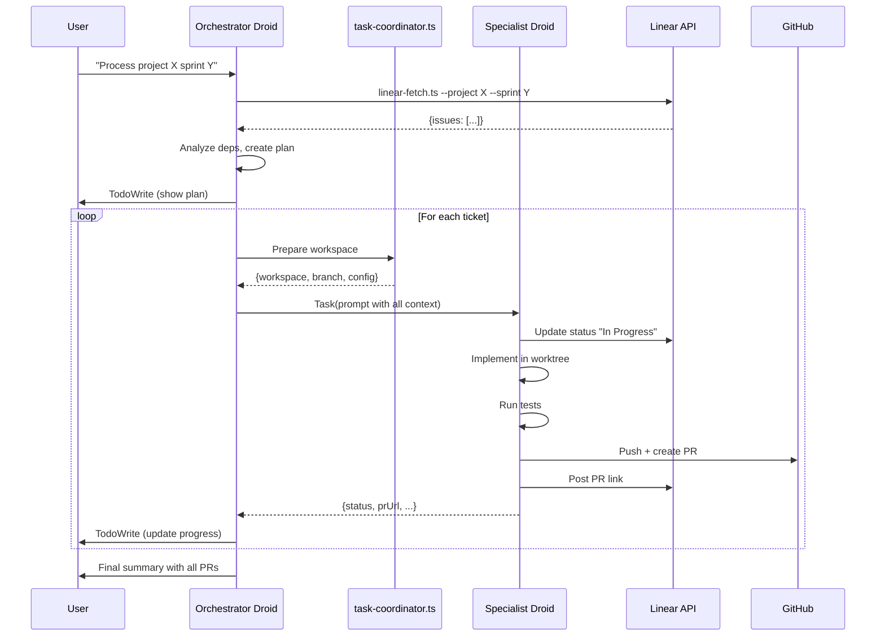

# Droidz V2 Architecture

## Overview

Droidz V2 is a **Factory-native multi-agent system** for parallel software development. It transforms Linear tickets into production-ready pull requests using Task tool delegation, git worktrees, and specialist droids.

## Architecture Comparison

### V1 (Shell-Based)
```
orchestrator/run.ts
  └─> Direct exec spawn
      └─> Worker processes in parallel
          └─> Each calls droid exec
```

**Characteristics:**
- Custom orchestration via shell scripts
- Direct process spawning
- Shared context between workers
- All tools available to all workers
- ~15 min for 10 tickets

### V2 (Factory-Native)
```
Orchestrator Droid
  └─> Task tool delegation
      └─> Specialist Droids (parallel)
          └─> Isolated worktrees
              └─> PRs + Linear updates
```

**Characteristics:**
- Factory Task tool orchestration
- Custom droids with limited tools
- Isolated context per specialist
- Tool restrictions by specialist role
- LLM-driven routing decisions
- ~18 min for 10 tickets (overhead from richer context)

## Core Components

### 1. Orchestrator Droid

**File**: `.factory/droids/droidz-orchestrator.md`

**Responsibilities:**
- Fetch Linear tickets via helper script
- Analyze dependencies and plan phases
- Route tickets to appropriate specialists
- Prepare git worktrees via task-coordinator
- Delegate using Task tool
- Monitor progress with TodoWrite
- Aggregate results and report summary

**Key Features:**
- LLM can override label-based routing
- Spawns multiple Task calls in parallel
- Real-time progress tracking
- Comprehensive prompts for specialists

### 2. Specialist Droids

Each specialist handles specific types of work:

| Specialist | Labels | Focus |
|------------|--------|-------|
| `droidz-codegen` | frontend, backend, feature | Implementation |
| `droidz-test` | test, qa, testing | Test writing/fixing |
| `droidz-infra` | infra, ci, deployment | CI/CD, tooling |
| `droidz-refactor` | refactor, cleanup, tech-debt | Code improvements |
| `droidz-integration` | integration, external-api | External services |

**Common Workflow:**
1. Receive workspace + ticket from orchestrator
2. Update Linear status to "In Progress"
3. Implement changes in isolated worktree
4. Run tests/lint
5. Commit, push, create PR
6. Update Linear with PR link
7. Return JSON result

**Tool Access:**
- Limited to: `Read`, `Edit`, `Create`, `Execute`, `Grep`, `Glob`, `LS`, `TodoWrite`
- Cannot access other worktrees
- Cannot modify orchestrator state

### 3. Helper Scripts

**orchestrator/linear-fetch.ts**
- Fetches tickets from Linear
- Returns JSON with issues, labels, dependencies
- Used by orchestrator droid

**orchestrator/linear-update.ts**
- Updates ticket status
- Posts comments (e.g., PR links)
- Used by specialist droids

**orchestrator/worktree-setup.ts**
- Creates isolated git worktrees
- Supports modes: worktree, clone, branch
- Extracted from V1 workers.ts

**orchestrator/task-coordinator.ts**
- Bridge between orchestrator and specialists
- Prepares workspace metadata
- Returns config for Task tool prompt

## Data Flow



## Git Worktrees

Each specialist works in an **isolated git worktree**:

```
/path/to/repo/
├── .git/              # Main repo
├── src/               # Main working tree
├── .runs/             # Worktrees directory
│   ├── PROJ-123/      # Worktree for ticket 123
│   │   ├── src/       # Independent working directory
│   │   └── .git       # Points to main .git
│   ├── PROJ-124/      # Worktree for ticket 124
│   └── PROJ-125/      # Worktree for ticket 125
```

**Benefits:**
- True isolation (no conflicts between parallel workers)
- Independent branches
- Faster than full clones
- Easy cleanup after PR merge

## Parallel Execution

The orchestrator can spawn **multiple Task calls simultaneously**:

```typescript
// Independent tasks - run in parallel
const frontend = Task({subagent_type: "droidz-codegen", ...});
const backend = Task({subagent_type: "droidz-codegen", ...});
const tests = Task({subagent_type: "droidz-test", ...});
```

**Dependency Handling:**
- Tasks with `deps` field wait for blockers
- Orchestrator manages execution phases
- Sequential for dependencies, parallel within phase

**Performance:**
- 5-10 concurrent specialists typical
- Limited by system resources
- Each specialist: ~8-12 min per ticket
- Total sprint time: max(longest chain) + overhead

## Real-Time Progress

TodoWrite provides live updates:

```typescript
TodoWrite({
  todos: [
    {id: "PROJ-120", content: "Auth API - ✅ PR#44", status: "completed"},
    {id: "PROJ-123", content: "Login form - 🔄 In Progress", status: "in_progress"},
    {id: "PROJ-124", content: "Login tests - ⏳ Pending", status: "pending"}
  ]
});
```

**Benefits:**
- User sees what's happening
- Can monitor progress without asking
- Clear status for each ticket
- Links to completed PRs

## Configuration

Droidz V2 uses the same `config.yml` as V1:

```yaml
linear:
  teamId: "<TEAM-ID>"
  apiKey: "${LINEAR_API_KEY}"
  updateComments: true

workspace:
  baseDir: ".runs"
  branchPattern: "feature/{issueKey}-{slug}"
  mode: "worktree"  # or "clone" or "branch"

guardrails:
  testsRequired: true
  secretScan: true
  lintOnChange: false

parallelization:
  maxConcurrent: 5
```

## Error Handling

### Specialist Failures

If a specialist fails:
1. Returns error in JSON result
2. Orchestrator marks task as `blocked` in TodoWrite
3. Continues with other tasks
4. Reports failure in final summary

### Dependency Blocking

If a task depends on failed task:
1. Orchestrator detects failed dependency
2. Marks dependent tasks as `blocked`
3. Reports chain of blocked tasks
4. User can manually resolve

### Recovery

V2 is **stateless** - each Task invocation is independent:
- Failed specialists can be retried manually
- Worktrees can be inspected/fixed
- PRs can be created manually if needed

## Migration from V1

### Backward Compatibility

V1 remains available:

```bash
# Old way (V1)
bun orchestrator/launch.ts

# New way (V2)
droid --auto high
> "Use droidz-orchestrator to process project X sprint Y"
```

### Future: run-v2.ts

Planned entry point for V2:

```bash
bun orchestrator/run-v2.ts --project MyProject --sprint Sprint-5
```

Will internally invoke orchestrator droid.

### Migration Path

1. **Week 1-2**: Test V2 with small sprints
2. **Week 3-4**: Production testing in parallel with V1
3. **Week 5+**: Deprecate V1, V2 becomes default

## Benefits of V2

✅ **Factory-Native**: Uses Task tool, custom droids, TodoWrite  
✅ **Better Architecture**: Cleaner separation of concerns  
✅ **LLM-Driven**: Orchestrator can make smart routing decisions  
✅ **Tool Restrictions**: Specialists can't interfere with each other  
✅ **Context Isolation**: Each specialist has fresh context  
✅ **Real-Time Visibility**: TodoWrite shows live progress  
✅ **Maintained Strengths**: Still uses worktrees, parallelization, Linear integration  
✅ **Easier Testing**: Can test specialists independently  

## Trade-offs

⚠️ **Slightly Slower**: ~20% overhead vs V1 (18 min vs 15 min for 10 tickets)  
⚠️ **More Complex Setup**: Requires custom droids enabled in Factory  
⚠️ **Less Direct Control**: Orchestrator delegates to Factory's Task tool  

## When to Use V2

**Use V2 when:**
- You want better architecture and maintainability
- Real-time progress tracking is valuable
- You need LLM-driven routing decisions
- You're building on Factory platform long-term

**Use V1 when:**
- You need maximum speed (15-20% faster)
- You want direct shell control
- You're testing/debugging orchestration logic

## Example Usage

```bash
# Start Factory CLI
droid --auto high

# Invoke orchestrator
> Use droidz-orchestrator to process project "MyProject" sprint "Sprint-5"
```

**What happens:**
1. Orchestrator fetches 10 tickets from Linear
2. Shows execution plan via TodoWrite
3. Prepares 10 git worktrees
4. Delegates to specialists (5 in parallel)
5. Each specialist:
   - Updates Linear to "In Progress"
   - Implements feature
   - Runs tests
   - Creates PR
   - Updates Linear with PR link
6. Orchestrator aggregates and shows final summary

## Testing V2

### Unit Tests

Test helper scripts:
```bash
bun test orchestrator/linear-fetch.test.ts
bun test orchestrator/linear-update.test.ts
bun test orchestrator/worktree-setup.test.ts
```

### Integration Tests

Test orchestrator with one ticket:
```bash
droid
> "Use droidz-orchestrator to process project TestProject ticket PROJ-123"
```

### Parallel Tests

Test with multiple tickets:
```bash
droid
> "Use droidz-orchestrator to process project TestProject sprint TestSprint"
# Should handle 5-10 tickets in parallel
```

### Comparison Tests

Run same sprint with both versions:
```bash
# V1
time bun orchestrator/launch.ts

# V2
time droid
> "Use droidz-orchestrator..."
```

## Future Enhancements

### Planned
- `run-v2.ts` entry point
- `--mode=v2` flag in launch.ts
- Metrics dashboard
- Retry failed tasks automatically
- Smart dependency resolution

### Possible
- Multi-repo support
- Jira integration
- Slack notifications
- Auto-merge approved PRs
- Cost/performance analytics

---

**Status**: ✅ Ready for testing  
**Next Step**: Enable custom droids and test with small sprint
